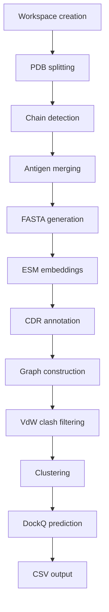

# DeepRank-Ab

DeepRank-Ab is a geometric deep learning scoring function for ranking antibody-antigen docking
models and predicting DockQ scores. Given a raw PDB, it runs chain detection, feature generation
(ESM-2 embeddings, CDR annotation, atom-level graphs), and EGNN inference to produce a predicted
DockQ score plus structural quality flags.

Preprint: https://www.biorxiv.org/content/10.64898/2025.12.03.691974v1

## Installation

> [!NOTE]
> **Linux only.** The vendored `hmmscan`/`voronota` binaries are x86-64 Linux ELF and won't run on macOS. 
>
> On macOS, use Docker instead (see below).


```bash
pip install deeprank-ab
```


> [!IMPORTANT]
> [ANARCI](https://github.com/oxpig/ANARCI) is vendored at `src/tools/ANARCI/anarci/`, not a pip
> dependency — its own install process doesn't work with modern Python packaging tools, so we
> ship a pre-built copy (package + germline database) instead.
>
> Distributed under ANARCI's original BSD-3-Clause license (`src/tools/ANARCI/anarci/LICENCE`,
> © 2019 Charlotte Deane, James Dunbar, Alexsandr Kovaltsuk, Claire Marks). Since it's a
> snapshot, it won't pick up upstream ANARCI updates automatically.

Working on the code itself instead? See [DEVELOPMENT.md](DEVELOPMENT.md).

## Running with Docker

Two image variants are published to GHCR: `*-cpu` and `*-gpu`, tagged `<release-tag>-cpu`/
`<release-tag>-gpu` plus `latest-cpu`/`latest-gpu` on every release. PRs also get a
`pr-<number>-cpu`/`pr-<number>-gpu` build for reviewing that PR's changes — those are
work-in-progress images, not for general use.


Mount your data directory to `/data`, set it as the working directory, and pass
`--user "$(id -u):$(id -g)"` — without it, the container runs as root and every file it creates
(workspace, `*.hdf5`, the ~2.5GB downloaded ESM-2 weights) ends up root-owned on your host:

```bash
docker run --rm \
  --user "$(id -u):$(id -g)" \
  -v "$PWD":/data \
  -w /data \
  ghcr.io/haddocking/deeprank-ab:latest-cpu \
  test.pdb
```

Chain-override flags work the same way, appended after the PDB file:

```bash
docker run --rm --user "$(id -u):$(id -g)" -v "$PWD":/data -w /data \
  ghcr.io/haddocking/deeprank-ab:latest-cpu \
  test.pdb --heavy_chain_id H --light_chain_id L --antigen_chain_id A
```

Your results will be at `<pdb_stem>-deeprank_ab_pred_<...>/`.

### GPU

The `*-gpu` image (built on `nvidia/cuda`) needs the
[NVIDIA Container Toolkit](https://docs.nvidia.com/datacenter/cloud-native/container-toolkit/latest/install-guide.html)
installed on the host, plus `--gpus all`:

```bash
docker run --rm --gpus all --user "$(id -u):$(id -g)" -v "$PWD":/data -w /data \
  ghcr.io/haddocking/deeprank-ab:latest-gpu \
  test.pdb
```

Build locally instead of pulling:

```bash
docker build --platform linux/amd64 -f Dockerfile.cpu -t deeprank-ab:cpu .
docker build --platform linux/amd64 -f Dockerfile.gpu -t deeprank-ab:gpu .
```

`--platform linux/amd64` matters even on Apple Silicon: the vendored `hmmscan`/`voronota`
binaries are x86-64 Linux ELF and only run correctly (via Rosetta emulation) on that platform —
an arm64 build would hit "exec format error" on them regardless of host.

## Usage

```bash
deeprank-ab-predict <pdb_file>
```

Example:

```bash
deeprank-ab-predict example/test.pdb
```

Input requirements:

- PDB file (single model or ensemble supported)
- Optional chain overrides: `--heavy_chain_id`, `--light_chain_id`, `--antigen_chain_id`

If not provided, chains are auto-detected via ANARCI.

## Pipeline



## Outputs

`*_predictions.hdf5` and a final `*.csv` with columns:

- `pdb_id`
- `predicted_dockq`
- `HL_contact_flag`: `ok` / `low_HL_contacts` / `not_applicable`
- `vdw_clash_flag`: `ok` / `potential_clash`

## Support

Open a GitHub issue for help.
